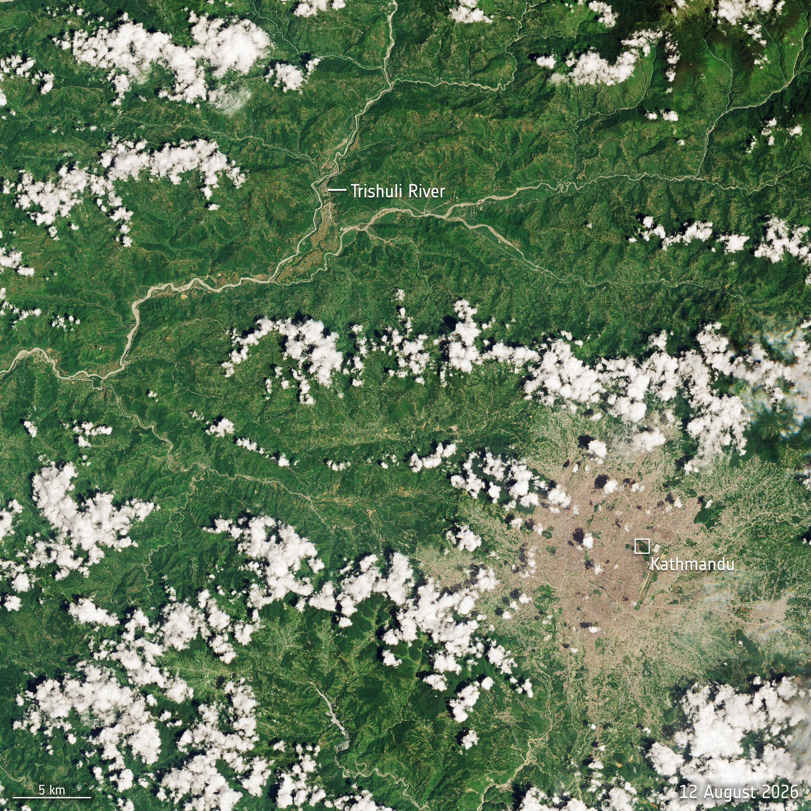

# Nepal 2026 Flood Impact Analysis



*Satellite imagery: ESA / Copernicus Sentinel-2*

## Project Overview

This project analyzes the impact of the **25–26 August 2026 Nepal flood and mass-movement event** in **Syapru Besi, Rasuwa, Nepal**, using satellite-based damage assessment data from the **Copernicus Emergency Management Service (CEMS)**.

The analysis focuses on buildings, transportation infrastructure, land use, and facilities within **AOI 01 – Syapru Besi**.

The project demonstrates an end-to-end data analytics workflow:

**Raw data → Excel cleaning & validation → SQL analysis → Python EDA & visualization → Excel dashboard → Portfolio website → Insights**

---

## 🌐 Live Portfolio Website

Explore the complete visual case study:

🔗 **[View the Live Portfolio Website](https://singuharshitha333.github.io/Nepal-2026-Flood-Impact-Analysis/)**

The website presents the project's key findings, visualizations, analytical workflow, dashboard, data sources, and limitations.

---

## Objectives

- Assess the extent of building damage within the AOI.
- Compare residential and non-residential building impacts.
- Quantify affected transportation infrastructure.
- Analyze affected land-use categories.
- Identify affected facilities.
- Calculate key impact percentages and summarize findings through a dashboard.
- Present the analysis as a clear data storytelling portfolio.

---

## Tools & Technologies

- **Microsoft Excel** — data cleaning, validation, summaries, and dashboard
- **Microsoft SQL Server / SSMS** — data storage and SQL analysis
- **Python** — exploratory data analysis and visualization
- **Pandas** — data manipulation
- **Matplotlib** — visualization
- **GitHub** — project version control and hosting
- **GitHub Pages** — portfolio website

---

## Data Source

**Copernicus Emergency Management Service (CEMS)**

Event: **Nepal flood and mass movement, 25–26 August 2026**  
Product: **EMSR927 – AOI 01 Syapru Besi, Rasuwa**

The dataset was accessed through the **UNESCO Intergovernmental Hydrological Programme – Water Information Network System (IHP-WINS)**.

The original source workbook was preserved, while separate analytical tables were created for cleaning and analysis.

### Source Links

- [Copernicus EMS – EMSR927](https://mapping.emergency.copernicus.eu/news/flood-in-nepal-emsr927/)
- [UNESCO IHP-WINS Dataset](https://ihp-wins.unesco.org/en/dataset/damage-grading-syapru-besi-and-timure-rasuwa-district-nepal-27-august-2026)

---

## Key Findings

### 🏠 Building Impact

- **559 buildings** were represented within the AOI.
- **433 buildings** were classified as affected.
- Overall building affected rate: **77.46%**.
- **323 buildings** were classified as destroyed.
- **78 buildings** were classified as possibly damaged.
- **32 buildings** were classified as damaged.
- **126 buildings** had no visible damage.

### Residential vs Non-Residential

| Asset Type | Total Buildings | Affected | Affected Rate |
|---|---:|---:|---:|
| Residential | 517 | 392 | 75.82% |
| Non-residential | 42 | 41 | 97.62% |

---

## 🚧 Transportation Impact

| Transportation Type | Affected | Unit |
|---|---:|---|
| Primary Road | 5.4 | km |
| Local Road | 1.1 | km |
| Cart Track | 1.1 | km |
| Bridges/elevated highways | 5 | count |
| Helipad | 0.01 | ha |

---

## 🌳 Land Use Impact

A total of **111.0 hectares** of the represented land-use area was affected.

| Land Use | Affected Area | Total Area | Affected Rate |
|---|---:|---:|---:|
| Forests | 61.6 ha | 228.8 ha | 26.92% |
| Shrub/herbaceous | 31.8 ha | 93.1 ha | 34.16% |
| Inland wetlands | 12.1 ha | 14.6 ha | 82.88% |
| Other | 3.4 ha | 4.3 ha | 79.07% |
| Heterogeneous agricultural | 2.1 ha | 5.1 ha | 41.18% |

---

## ⚡ Facilities Impact

- **0.8 hectares** of power plant construction area was affected.

---

## 📊 Visualizations

The project includes six Python-generated visualizations:

1. Building damage status
2. Affected buildings by asset type
3. Transportation impact
4. Land-use impact
5. Transportation affected percentage
6. Land-use affected area

The visualizations are included in the `images/` folder.

---

## 📁 Project Structure

```text
Nepal-2026-Flood-Impact-Analysis/
│
├── images/
│   ├── building_damage_status.png
│   ├── affected_buildings_by_asset_type.png
│   ├── transportation_impact.png
│   ├── landuse_impact.png
│   ├── transportation_affected_percentage.png
│   ├── landuse_affected_area.png
│   └── nepal-flood-satellite.jpg
│
├── nepal_flood_cleaned.xlsx.xlsx
├── analysis.sql
├── eda.py
└── README.md
